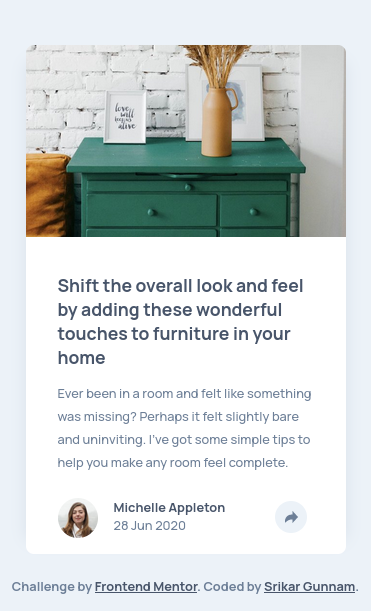
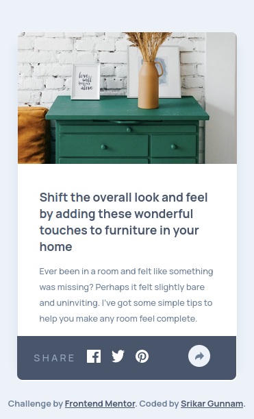
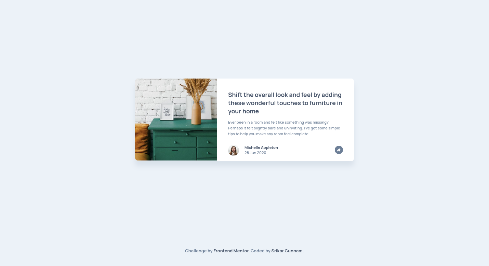
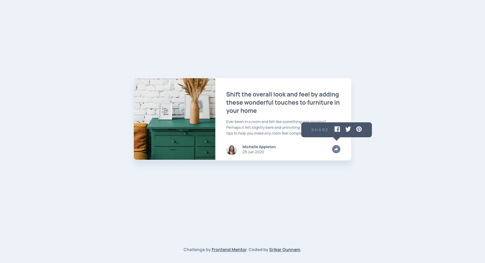

# Frontend Mentor - Article preview component solution

This is a solution to the [Article preview component challenge on Frontend Mentor](https://www.frontendmentor.io/challenges/article-preview-component-dYBN_pYFT). Frontend Mentor challenges help you improve your coding skills by building realistic projects. 

## Table of contents

- [Frontend Mentor - Article preview component solution](#frontend-mentor---article-preview-component-solution)
  - [Table of contents](#table-of-contents)
  - [Overview](#overview)
    - [The challenge](#the-challenge)
    - [Screenshot](#screenshot)
      - [Mobile Preview along with active states](#mobile-preview-along-with-active-states)
      - [Desktop preview along with active states](#desktop-preview-along-with-active-states)
    - [Links 🔗](#links-)
  - [My process 📜](#my-process-)
    - [Built with 🏗](#built-with-)
    - [What I learned 📖](#what-i-learned-)
    - [Continued development 💪](#continued-development-)
    - [Useful resources 📚	🗃](#useful-resources-)
  - [Author 👦](#author-)
    - [Srikar Gunnam](#srikar-gunnam)

## Overview

### The challenge

Users should be able to:

- View the optimal layout for the component depending on their device's screen size
- See the social media share links when they click the share icon

### Screenshot

#### Mobile Preview along with active states
 

#### Desktop preview along with active states

### Links 🔗

- [Solution URL](https://github.com/srikargunnam/frontendmentor-article-preview-component-master)
- [Live Site URL](https://srikargunnam.github.io/frontendmentor-article-preview-component-master/)

## My process 📜

### Built with 🏗

- Semantic HTML5 markup
- CSS & Sass/Scss
- Flexbox
- CSS Grid
- Mobile-first workflow 

### What I learned 📖

When i saw many websites where you click on share or some other similar option, some pop-up will appear and disppear when you click anywhere on the document, i never thought of how that used to happen, but with this project i implemented the similar feature, it worked well, but i don't know whether it is the right appraoch which i did or not.

### Continued development 💪

I observed a lot of improvement in my frontend desing approach, and i will keep it up and continue development of my overall approach. 

### Useful resources 📚	🗃

- [MDN](https://developer.mozilla.org/en-US/docs/Web/CSS/) - As usual, this will be a very usefull resource for every front end developer who works with HTML, CSS and JavaScript and evern for newbies who enter this field.
- [converting colors](https://convertingcolors.com) - this i used to convert some hsl formatted colors to hex, it might be useful even more than what i have used, will explore based on my neeeds.

## Author 👦

### Srikar Gunnam

- Website - [srikargunnam.com](https://srikargunnam.com) 	🕸
- Frontend Mentor - [@srikargunnam](https://www.frontendmentor.io/profile/srikargunnam)
- Twitter - [@SrikarGunnam](https://twitter.com/SrikarGunnam)
- Codepen - [@srikargunnam](https://codepen.io/srikargunnam)
- GitHub - [@srikargunnam](https://github.com/srikargunnam/)
